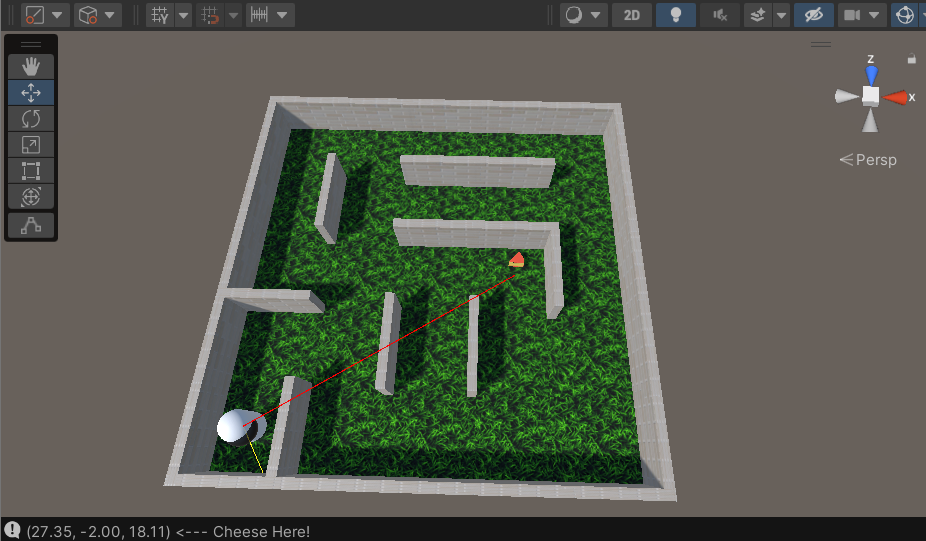

# Who Moved My Cheese





**Who Moved my Cheese** is a game that uses deep reinforcement learning and imitation learning to train an intelligent agents using Unity Machine Learning Agents Toolkit [ML-Agents](https://github.com/Unity-Technologies/ml-agents). The intelligent agent navigates through a maze in search for slices of swiss cheese. This page will guide you through the installation and setting the environment to run the game on your machine. 


## (Windows Users only)

## Requirements 

- Python 3.9.12 [download here](https://www.python.org/downloads/).
- Unity Hub (Unity 2021.3.11f1) [download here](https://unity.com/download).
- Unity ML-Agents Toolkit (ML-Agents Toolkit v2.3.0-exp.3).

## Install com.unity.ml-agents package

- Please refer to [docs](https://github.com/Unity-Technologies/ml-agents/blob/develop/docs/Installation.md#install-the-comunityml-agents-unity-package).


## Setting up the environments

**To run this project on your machine, follow these steps:**

#### 1. Create a virtual environment 
```bash
python -m venv env
```
#### 2. Activate the virtual environment
```sh
source env/bin/activate
```
#### 3. Install `mlagents`
```sh
python -m pip install mlagents==0.30.0
```
- Verify installation
```sh
mlagents-learn --help
```

#### 4. Install `pytorch`
```bash
pip install torch torchvision torchaudio
```

## Running the project
1. Start the Unity Editor.
2. Drag the Maze Scene from the Project panel into the Hierarchy panel. 
3. Locate the `Brains folder` in the project panel.
4. Drag brain model into the Model in the Behaviour Parameters Script under the Inspector panel.
5. Set Behaviour type to `Inference`.


#### Peace!✌️
